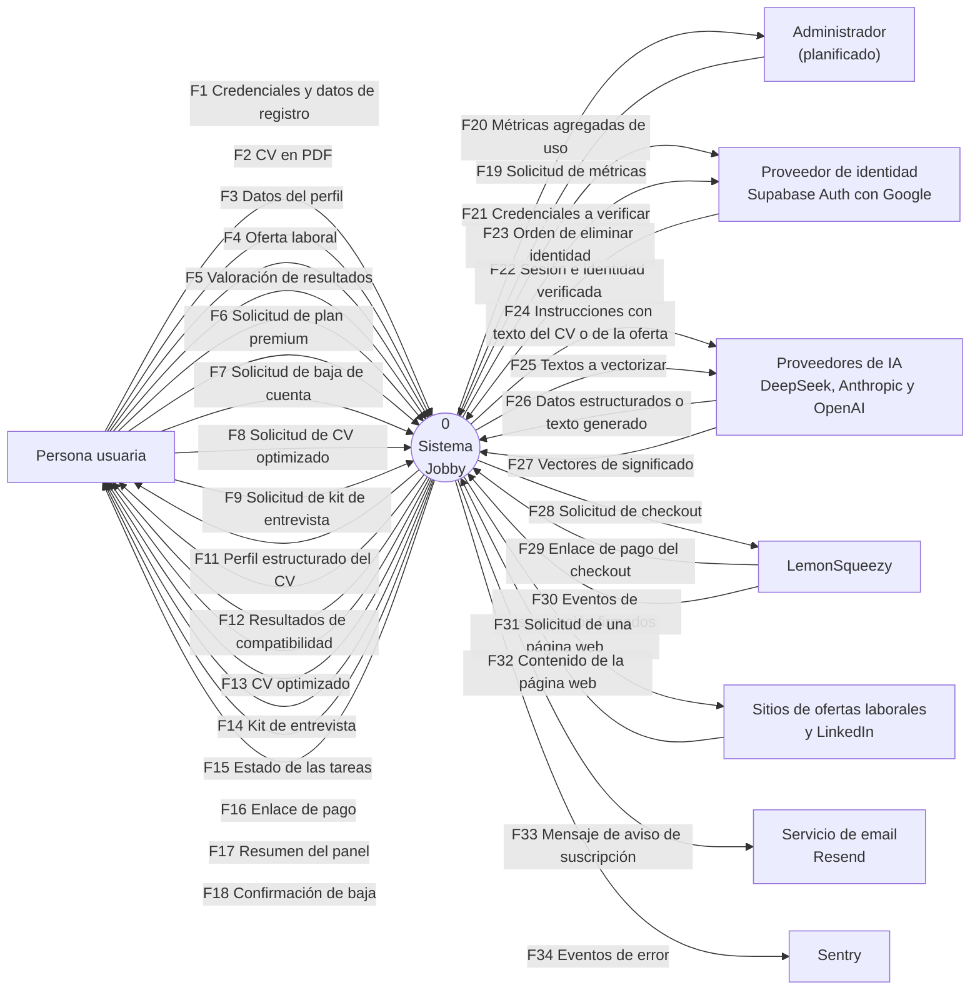
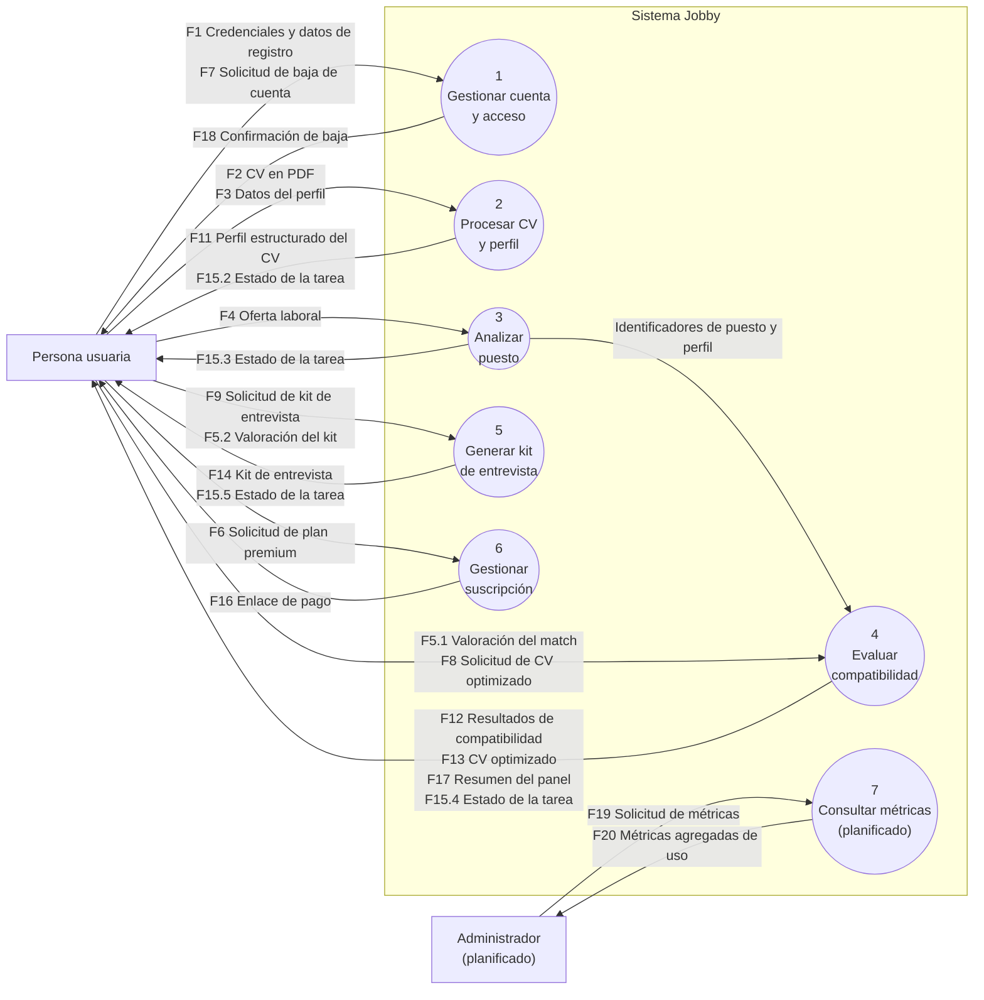
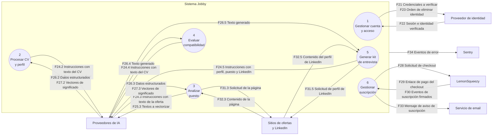
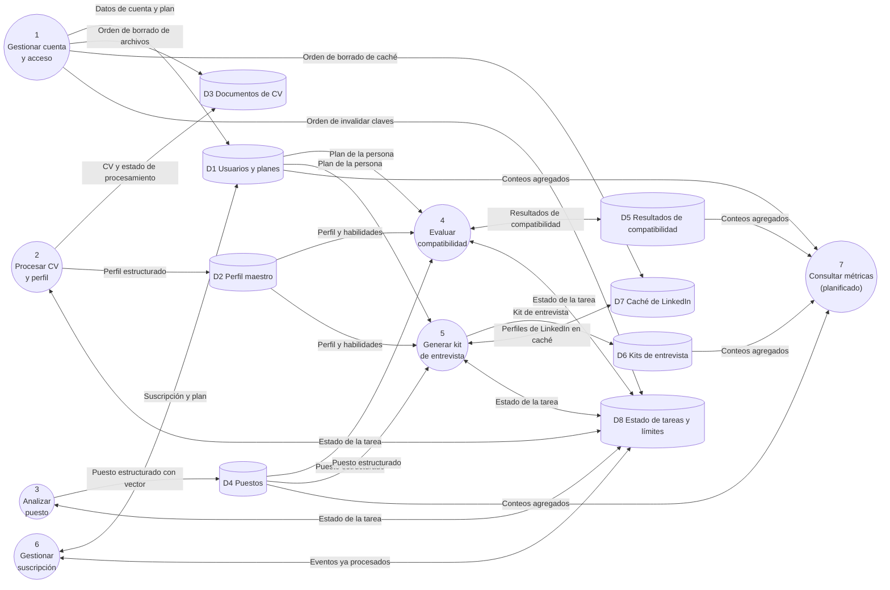

# Diagramas de flujo de datos (DFD)

Estado: Etapa 1, niveles 0 y 1. El nivel 2 se agrega en el siguiente documento de la serie.

## Convenciones

| Símbolo | Significa |
|---|---|
| Rectángulo | Entidad externa (persona o sistema de terceros) |
| Círculo numerado | Proceso |
| Cilindro `D#` | Almacén de datos |
| Flecha | Flujo de datos, rotulado con **el dato que viaja** y no con la acción |

Todo lo descrito se verificó contra el código: los endpoints de `services/api/app/api/v1/`,
las tareas de `services/api/app/tasks/` y las pantallas de `apps/web`. Lo que aún no existe
está marcado como **planificado**.

## 1. Nivel 0: diagrama de contexto

El sistema completo es un único proceso, rodeado de sus entidades externas.

### Entidades externas

| Entidad | Quién es |
|---|---|
| Persona usuaria | Quien busca empleo; usa el plan gratuito o el premium |
| Administrador | Consulta métricas agregadas, sin acceso a CV ni a datos personales (**planificado**, Decisión 2) |
| Proveedor de identidad | Supabase Auth, con inicio de sesión federado con Google |
| Proveedores de IA | DeepSeek (principal), Anthropic (premium) y OpenAI (solo vectores) |
| LemonSqueezy | Cobra la suscripción premium |
| Sitios de ofertas laborales y LinkedIn | Páginas públicas que se leen para obtener el texto de un puesto |
| Servicio de email | Resend, para avisos de suscripción |
| Sentry | Recibe los eventos de error |

### Flujos del nivel 0

| ID | Dato | Origen | Destino |
|---|---|---|---|
| F1 | Credenciales y datos de registro | Persona usuaria | Sistema |
| F2 | CV en PDF | Persona usuaria | Sistema |
| F3 | Datos del perfil (experiencia, educación, idiomas, habilidades) | Persona usuaria | Sistema |
| F4 | Oferta laboral (URL o texto) | Persona usuaria | Sistema |
| F5 | Valoración de resultados (del match y del kit) | Persona usuaria | Sistema |
| F6 | Solicitud de plan premium | Persona usuaria | Sistema |
| F7 | Solicitud de baja de cuenta | Persona usuaria | Sistema |
| F8 | Solicitud de CV optimizado | Persona usuaria | Sistema |
| F9 | Solicitud de kit de entrevista | Persona usuaria | Sistema |
| F11 | Perfil estructurado del CV | Sistema | Persona usuaria |
| F12 | Resultados de compatibilidad (Match Score, reporte ATS y Reality Gap) | Sistema | Persona usuaria |
| F13 | CV optimizado | Sistema | Persona usuaria |
| F14 | Kit de entrevista | Sistema | Persona usuaria |
| F15 | Estado de las tareas | Sistema | Persona usuaria |
| F16 | Enlace de pago | Sistema | Persona usuaria |
| F17 | Resumen del panel | Sistema | Persona usuaria |
| F18 | Confirmación de baja | Sistema | Persona usuaria |
| F19 | Solicitud de métricas | Administrador | Sistema |
| F20 | Métricas agregadas de uso | Sistema | Administrador |
| F21 | Credenciales a verificar | Sistema | Proveedor de identidad |
| F22 | Sesión e identidad verificada | Proveedor de identidad | Sistema |
| F23 | Orden de eliminar identidad | Sistema | Proveedor de identidad |
| F24 | Instrucciones con texto del CV o de la oferta | Sistema | Proveedores de IA |
| F25 | Textos a vectorizar | Sistema | Proveedores de IA |
| F26 | Datos estructurados o texto generado | Proveedores de IA | Sistema |
| F27 | Vectores de significado | Proveedores de IA | Sistema |
| F28 | Solicitud de checkout | Sistema | LemonSqueezy |
| F29 | Enlace de pago del checkout | LemonSqueezy | Sistema |
| F30 | Eventos de suscripción firmados | LemonSqueezy | Sistema |
| F31 | Solicitud de una página web (del puesto o de un perfil de LinkedIn) | Sistema | Sitios de ofertas |
| F32 | Contenido de la página web | Sitios de ofertas | Sistema |
| F33 | Mensaje de aviso de suscripción | Sistema | Servicio de email |
| F34 | Eventos de error | Sistema | Sentry |

`F10` no se usa: la numeración se conserva para que los identificadores no cambien entre
niveles.

## 2. Nivel 1: procesos principales

El proceso 0 se descompone en siete procesos y ocho almacenes de datos.

Para que se lea al imprimirlo, el nivel 1 se dibuja en tres vistas del mismo diagrama, todas
con los mismos procesos y la misma numeración: la **vista 1A** muestra las personas y sus flujos,
la **vista 1B** los sistemas externos y sus flujos, y la **vista 1C** los ocho almacenes de datos.

### Vista 1A: procesos y personas

### Vista 1B: procesos y sistemas externos

El proceso 7 no aparece en esta vista porque no intercambia datos con sistemas externos.

### Vista 1C: procesos y almacenes de datos

### Procesos

| N.º | Proceso | Qué hace | Se apoya en |
|---|---|---|---|
| 1 | Gestionar cuenta y acceso | Registro e inicio de sesión (con Supabase Auth) y baja de cuenta: borra archivos, caché, claves, el usuario (los datos personales se eliminan en cascada) y la identidad | `DELETE /users/me` |
| 2 | Procesar CV y perfil | Recibe el PDF, extrae su texto, lo estructura con IA, genera vectores y arma el perfil maestro; permite confirmar o rechazar habilidades y completar experiencia, educación e idiomas | `POST /profiles/documents`, `/profiles/*` |
| 3 | Analizar puesto | Valida la URL o el texto, obtiene el contenido de la página, lo estructura con IA, genera vectores y guarda el puesto | `POST /jobs/analyze` |
| 4 | Evaluar compatibilidad | Calcula el Match Score, el reporte ATS y el Reality Gap, arma el resumen del panel y, en el plan premium, optimiza el CV con IA | `/matches`, `/ats`, `/dashboard`, `/profiles/reality-gap` |
| 5 | Generar kit de entrevista | Solo plan premium: arma el kit con IA a partir del perfil, el puesto y, si se indican, perfiles de LinkedIn | `/interview-kits` |
| 6 | Gestionar suscripción | Crea el checkout, recibe los eventos firmados de LemonSqueezy, actualiza el plan y avisa por email | `POST /billing/checkout`, `POST /webhooks/lemonsqueezy` |
| 7 | Consultar métricas agregadas | Devuelve conteos sin datos personales al administrador (**planificado**) | (no existe todavía) |

### Almacenes de datos

| N.º | Almacén | Contenido | Tablas o servicio |
|---|---|---|---|
| D1 | Usuarios y planes | Cuenta, plan free o premium y estado de la suscripción | `users` |
| D2 | Perfil maestro | Perfil, habilidades, experiencia, educación, idiomas y certificaciones | `master_profiles`, `skills`, `experiences`, `educations`, `languages`, `certifications`, `rejected_skills` |
| D3 | Documentos de CV | Archivos PDF y su estado de procesamiento | `uploaded_documents` y el bucket privado `cv-documents` de Storage |
| D4 | Puestos | Ofertas estructuradas con su vector | `job_descriptions` |
| D5 | Resultados de compatibilidad | Match Score y detalle por puesto | `job_matches` |
| D6 | Kits de entrevista | Kits generados y su valoración | `interview_kits` |
| D7 | Caché de LinkedIn | Perfiles ya leídos, para no repetir la lectura | `linkedin_scrape_cache` |
| D8 | Estado de tareas y límites | Estado de las tareas, límites de uso y eventos de pago ya procesados | Redis (Upstash) |

## 3. Correspondencia entre el nivel 0 y el nivel 1

Cada flujo del nivel 0 aparece en el nivel 1, entero o partido en sub-flujos (`F15` en `F15.2` a
`F15.5`, por ejemplo), y **no aparece ningún flujo externo nuevo**. Los únicos flujos que no
figuran en el nivel 0 son internos: los que van hacia y desde los almacenes y el que encadena
el proceso 3 con el 4.

| Flujo del nivel 0 | Nivel 1 | Proceso |
|---|---|---|
| F1, F7, F18 | F1, F7, F18 | 1 |
| F21, F22, F23 | F21, F22, F23 | 1 |
| F2, F3, F11 | F2, F3, F11 | 2 |
| F4 | F4 | 3 |
| F5 | F5.1 (match) y F5.2 (kit) | 4 y 5 |
| F8, F12, F13, F17 | F8, F12, F13, F17 | 4 |
| F9, F14 | F9, F14 | 5 |
| F6, F16, F28, F29, F30, F33 | F6, F16, F28, F29, F30, F33 | 6 |
| F19, F20 | F19, F20 | 7 |
| F15 | F15.2, F15.3, F15.4 y F15.5 | 2, 3, 4 y 5 |
| F24 | F24.2, F24.3, F24.4 y F24.5 | 2, 3, 4 y 5 |
| F25 | F25.2 y F25.3 | 2 y 3 |
| F26 | F26.2, F26.3, F26.4 y F26.5 | 2, 3, 4 y 5 |
| F27 | F27.2 y F27.3 | 2 y 3 |
| F31 | F31.3 y F31.5 | 3 y 5 |
| F32 | F32.3 y F32.5 | 3 y 5 |
| F34 | F34 (desde el conjunto de procesos) | 1 a 6 |

Comprobación de equilibrio: de los 33 flujos del nivel 0 (F1 a F34 sin F10), los 33 tienen su
correspondiente en el nivel 1, con el mismo origen y destino externos.
