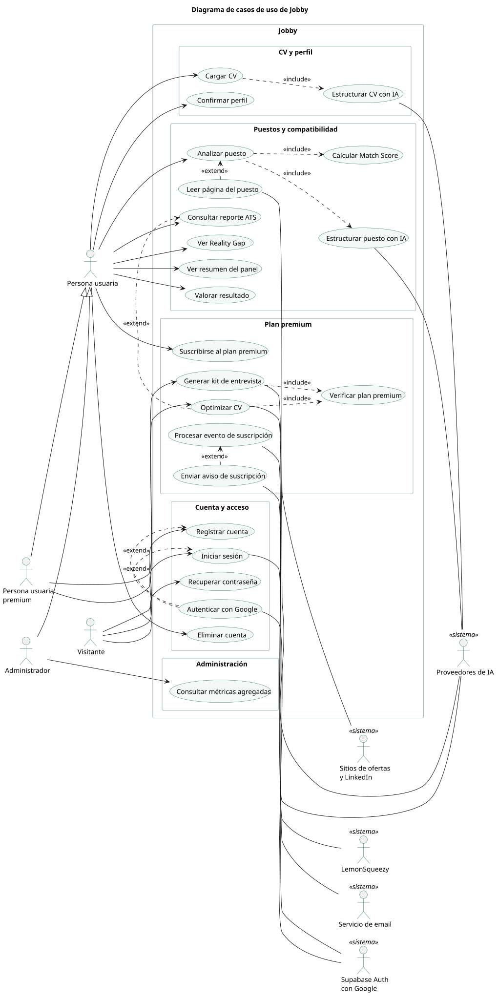

# Casos de uso

Estado: Etapa 1. Todo se verificó contra el código: endpoints de `services/api/app/api/v1/`,
tareas de `services/api/app/tasks/` y pantallas de `apps/web`. Lo que aún no existe está marcado
como **planificado**.

## 1. Diagrama

Fuente del diagrama: [diagramas/casos-de-uso.puml](diagramas/casos-de-uso.puml).

### Actores

| Actor | Tipo | Quién es |
|---|---|---|
| Visitante | Humano | Persona sin cuenta o sin sesión iniciada |
| Persona usuaria | Humano | Persona con cuenta y plan gratuito |
| Persona usuaria premium | Humano | Hereda todo lo de la persona usuaria y suma el optimizador de CV y el kit de entrevista |
| Administrador | Humano | Consulta métricas agregadas, sin acceso a CV ni a datos personales (**planificado**, Decisión 2) |
| Supabase Auth con Google | Sistema | Verifica la identidad y emite la sesión |
| Proveedores de IA | Sistema | DeepSeek, Anthropic y OpenAI (solo vectores) |
| Sitios de ofertas y LinkedIn | Sistema | Páginas públicas cuyo contenido se lee |
| LemonSqueezy | Sistema | Cobra la suscripción y avisa los cambios con eventos firmados |
| Servicio de email | Sistema | Resend, envía los avisos de suscripción |

No hay procesos programados: las tareas de segundo plano se disparan siempre por una acción de
la persona o por un evento de LemonSqueezy.

### Relaciones `include` y `extend`

| Relación | Motivo |
|---|---|
| Cargar CV `include` Estructurar CV con IA | Siempre ocurre al cargar un CV |
| Analizar puesto `include` Estructurar puesto con IA | Siempre ocurre al analizar |
| Analizar puesto `include` Calcular Match Score | El match se calcula siempre al terminar el análisis |
| Leer página del puesto `extend` Analizar puesto | Solo cuando el puesto se indica con una URL |
| Optimizar CV `extend` Consultar reporte ATS | Opcional y solo premium, se ofrece desde el reporte |
| Optimizar CV y Generar kit de entrevista `include` Verificar plan premium | Ambos comprueban el plan antes de ejecutarse |
| Autenticar con Google `extend` Registrar cuenta e Iniciar sesión | Alternativa opcional al correo y la contraseña |
| Enviar aviso de suscripción `extend` Procesar evento de suscripción | Solo en pagos fallidos y vencimientos |

## 2. Catálogo

| ID | Caso de uso | Actor principal | Dónde está |
|---|---|---|---|
| CU01 | Registrar cuenta | Visitante | `/register` |
| CU02 | Iniciar sesión | Visitante | `/login` |
| CU03 | Recuperar contraseña | Visitante | `/forgot-password`, `/reset-password` |
| CU04 | Autenticar con Google | Visitante | Botones de `/login` y `/register` |
| CU05 | Cargar CV | Persona usuaria | Asistente, paso 2; `POST /profiles/documents` |
| CU06 | Estructurar CV con IA | Proveedores de IA | Tarea `parse_cv` |
| CU07 | Confirmar perfil | Persona usuaria | Asistente, paso 3; `/profiles/skills`, `/profiles/experiences` y afines |
| CU08 | Analizar puesto | Persona usuaria | `POST /jobs/analyze`; pantalla Jobs |
| CU09 | Leer página del puesto | Sitios de ofertas | Scraper con guarda anti-SSRF |
| CU10 | Estructurar puesto con IA | Proveedores de IA | Tarea `job_analysis` |
| CU11 | Calcular Match Score | Sistema | Tarea `match`; `GET /matches/{id}` |
| CU12 | Consultar reporte ATS | Persona usuaria | `GET /ats/{job_id}`; pantalla ATS |
| CU13 | Ver Reality Gap | Persona usuaria | `GET /profiles/reality-gap` |
| CU14 | Optimizar CV | Persona usuaria premium | `POST /ats/optimize` |
| CU15 | Generar kit de entrevista | Persona usuaria premium | `/interview-kits` |
| CU16 | Verificar plan premium | Sistema | Comprobación del plan en los casos premium |
| CU17 | Ver resumen del panel | Persona usuaria | `GET /dashboard/summary` |
| CU18 | Valorar resultado | Persona usuaria | `PATCH /matches/{id}/rating`, `PATCH /interview-kits/{id}/rating` |
| CU19 | Suscribirse al plan premium | Persona usuaria | `POST /billing/checkout`; pantalla Precios |
| CU20 | Procesar evento de suscripción | LemonSqueezy | `POST /webhooks/lemonsqueezy` |
| CU21 | Enviar aviso de suscripción | Sistema | Servicio de email |
| CU22 | Eliminar cuenta | Persona usuaria | `DELETE /users/me` |
| CU23 | Consultar métricas agregadas | Administrador | **Planificado** |

## 3. Narrativas de los tres casos de uso principales

### CU05 Cargar CV

- **Actor principal:** persona usuaria.
- **Actores secundarios:** proveedores de IA.
- **Precondiciones:** la persona tiene sesión iniciada, un perfil asociado y un CV en PDF.

**Flujo principal**

1. La persona abre el asistente, en el paso "Subí tu CV", y elige el archivo PDF.
2. La web sube el archivo al bucket privado `cv-documents` de Supabase Storage, dentro de la
   carpeta de su identificador.
3. La web envía `POST /profiles/documents` con la ruta del archivo, su tipo, el lugar del CV y
   los datos del archivo.
4. La API valida la sesión, prepara el lugar del CV y registra el documento con estado
   `pending`.
5. La API encola el procesamiento del CV y responde 201 con el identificador de la tarea.
6. La web sigue el avance con la conexión SSE `/tasks/{task_id}/stream`.
7. La tarea descarga el PDF, extrae su texto, lo estructura con IA, genera los vectores de las
   habilidades, guarda los datos extraídos, calcula la completitud del perfil y marca el
   documento como `done`.
8. La web muestra "Revisá la extracción" y la persona confirma lo que quiere sumar a su perfil
   maestro (habilidades, experiencia, educación e idiomas).
9. La API guarda lo confirmado en el perfil maestro.

**Flujos alternativos**

- **A1 (paso 3), datos inválidos:** la API responde un error de validación y no registra nada.
- **A2 (paso 4), ya había un CV en ese lugar:** se reemplaza por el nuevo.
- **A3 (paso 6), la API estaba dormida:** la web muestra el aviso de demora y reintenta la
  conexión hasta que la API responde (Decisión 14).
- **A4 (paso 7), falla el proveedor de IA o no responde:** el documento queda `failed`, la
  persona ve un mensaje claro sin detalles internos y puede volver al paso 1.
- **A5 (paso 8), la persona rechaza una habilidad:** queda registrada como rechazada y no se
  vuelve a sugerir.

**Postcondiciones:** el CV queda guardado con estado `done`; los datos confirmados quedan en el
perfil maestro y sus vectores guardados; la completitud del perfil queda actualizada, lo que
habilita analizar puestos.

### CU08 Analizar puesto

- **Actor principal:** persona usuaria.
- **Actores secundarios:** sitios de ofertas (si el puesto es una URL) y proveedores de IA.
- **Precondiciones:** sesión iniciada, perfil con al menos 60 % de completitud y límite mensual
  de análisis del plan sin agotar.

**Flujo principal**

1. La persona elige crear un puesto y pega una URL o el texto de la oferta.
2. La web envía `POST /jobs/analyze` con el origen (`url` o `text`) y el contenido.
3. La API valida la entrada: los tamaños y, si es una URL, que sea pública y segura.
4. La API comprueba que el perfil tenga al menos 60 % de completitud.
5. La API cuenta el análisis contra el límite mensual del plan.
6. La API encola el análisis y responde 202 con el identificador de la tarea.
7. La web sigue el avance por SSE.
8. La tarea obtiene el texto (leyendo la página si era una URL), lo estructura con IA, genera su
   vector y guarda el puesto.
9. Al terminar, la tarea encola el cálculo del match, que compara el perfil con el puesto y
   guarda el Match Score.
10. La web muestra el puesto con su Match Score y el detalle: habilidades, seniority, cobertura
    ATS y brechas.

**Flujos alternativos**

- **A1 (paso 3), URL inválida o no segura:** la API responde 400 con `JOB_URL_INVALID`.
- **A2 (paso 4), perfil incompleto:** la API responde 403 con `PROFILE_INCOMPLETE` e indica el
  porcentaje actual.
- **A3 (paso 5), límite mensual alcanzado:** la API responde 429 con
  `JOB_RATE_LIMIT_EXCEEDED` y la fecha de reinicio.
- **A4 (paso 8), no se puede leer la página:** la tarea falla con un mensaje público y la web
  sugiere pegar el texto de la oferta.
- **A5 (paso 8), falla el proveedor de IA:** mensaje genérico y opción de reintentar.

**Postcondiciones:** el puesto queda guardado con su vector, el resultado del match queda
guardado y el contador del límite mensual queda actualizado.

### CU19 Suscribirse al plan premium

- **Actor principal:** persona usuaria con plan gratuito.
- **Actores secundarios:** LemonSqueezy y el servicio de email.
- **Precondiciones:** sesión iniciada y plan gratuito.

**Flujo principal**

1. La persona abre Precios y elige el plan premium.
2. La web envía `POST /billing/checkout`.
3. La API arma la URL de checkout de LemonSqueezy con el identificador y el email de la persona
   y la devuelve.
4. La web lleva a la persona a LemonSqueezy, donde completa el pago. Jobby nunca ve los datos de
   la tarjeta.
5. LemonSqueezy devuelve a la persona a la pantalla de pago exitoso.
6. LemonSqueezy envía el evento `subscription_created` firmado a `POST /webhooks/lemonsqueezy`.
7. La API verifica la firma, comprueba que el evento no se haya procesado ya y actualiza el
   plan, el estado y la fecha de fin del período.
8. La persona pasa a tener disponibles el optimizador de CV y el kit de entrevista.

**Flujos alternativos**

- **A1 (paso 3), falla al armar el checkout:** la API responde 502 con
  `BILLING_CHECKOUT_FAILED` y el plan no cambia.
- **A2 (paso 4), la persona cancela el pago:** vuelve a la pantalla de cancelación y sigue con el
  plan gratuito.
- **A3 (paso 6), firma faltante o inválida:** la API responde 400 y no procesa el evento.
- **A4 (paso 7), evento repetido:** se ignora, sin cambiar nada.
- **A5 (paso 6), pago fallido o suscripción vencida:** el evento actualiza el plan y se envía un
  aviso por email (CU21).

**Postcondiciones:** el plan premium queda registrado con el estado y el fin de período; el
evento queda marcado como procesado.

**Nota:** hoy la interfaz muestra siempre el plan gratuito aunque la base registre premium: es el
pendiente P2 de [05-pendientes-producto.md](05-pendientes-producto.md).
