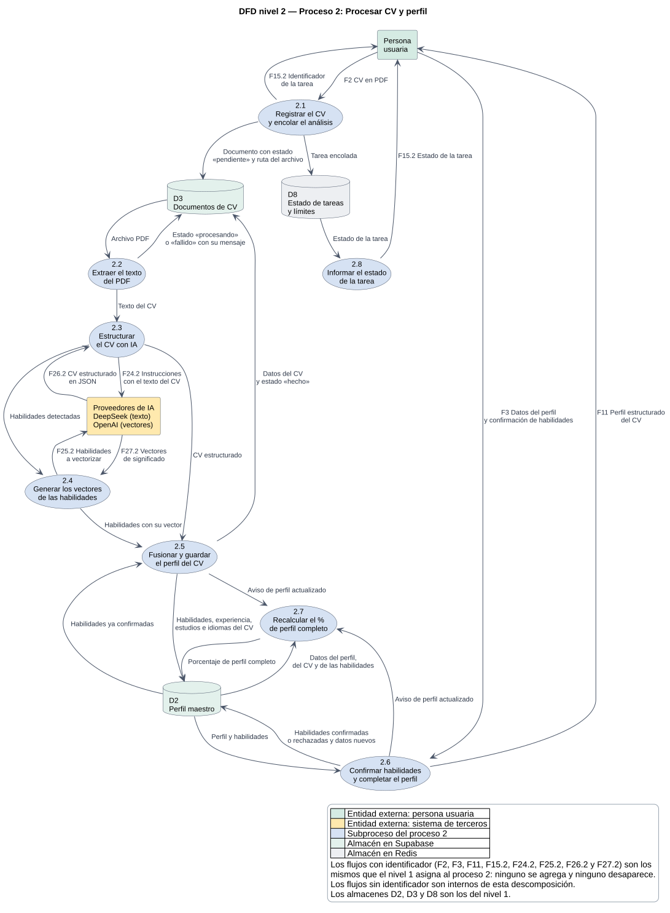
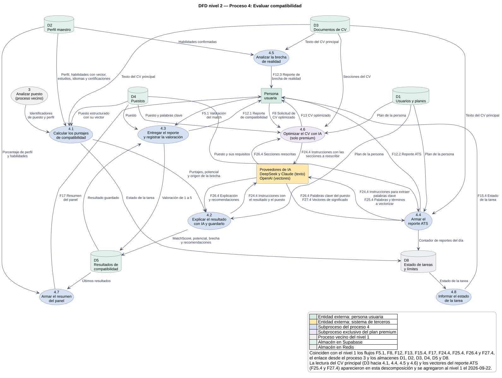

# Diagramas de flujo de datos (DFD): nivel 2

Estado: Etapa 1. Descompone los procesos 2 y 4 del [nivel 1](01-dfd.md). Verificado el
2026-09-21 contra el código de `apps/web` y `services/api`, no contra documentación previa.

## Convenciones

| Símbolo | Significa |
|---|---|
| Rectángulo | Entidad externa (la persona usuaria, los proveedores de IA). |
| Elipse numerada | Subproceso. La numeración es jerárquica: 2.1, 2.2… salen del proceso 2 y 4.1, 4.2… del proceso 4. |
| Cilindro `D#` | Almacén de datos, con el mismo número que en el nivel 1 (D1 a D8). |
| Flecha | Flujo rotulado con **el dato que viaja**. Los identificadores (F2, F24.4…) son los mismos de los niveles 0 y 1. |

Los diagramas están en PlantUML (`docs/diagramas/dfd-nivel-2-proceso-2.puml` y
`dfd-nivel-2-proceso-4.puml`) con su imagen `.svg` versionada, porque GitHub no dibuja PlantUML.
Se regeneran con `python docs/tools/render_diagrams.py`.

## 1. Por qué estos dos procesos

La consigna pide descomponer los procesos «de mayor relevancia». El proceso 2 (Procesar CV y
perfil) convierte un PDF en un perfil estructurado con vectores, y el proceso 4 (Evaluar
compatibilidad) produce el MatchScore, el reporte ATS y la brecha de realidad, que es lo que la
persona viene a buscar. Entre los dos concentran la IA, los vectores, las reglas de negocio
(perfil al 60 %, límites por plan, funciones premium) y seis de los ocho almacenes.

## 2. Proceso 2: Procesar CV y perfil

Para imprimir: lámina A3 en [pdf/laminas/dfd-nivel-2-proceso-2.pdf](pdf/laminas/dfd-nivel-2-proceso-2.pdf).

| N.º | Subproceso | Qué hace | Dónde está en el código |
|---|---|---|---|
| 2.1 | Registrar el CV y encolar el análisis | Recibe el PDF ya subido al almacén privado, guarda el documento como «pendiente» con su ruta, encola la tarea y devuelve su identificador. | `wizard/step-2`; `POST /profiles/documents` |
| 2.2 | Extraer el texto del PDF | Descarga el archivo y extrae el texto; si el PDF no tiene texto seleccionable, marca «fallido» con un mensaje apto para mostrar. | `tasks/parsing.py`; `cv_parser/pdf_extractor.py` |
| 2.3 | Estructurar el CV con IA | Pide a DeepSeek que ordene el texto en habilidades, experiencia, estudios, idiomas y certificaciones, y valida el JSON recibido. | `cv_parser/ai_structurer.py` |
| 2.4 | Generar los vectores de las habilidades | Convierte cada habilidad en un vector de significado de 1536 números con OpenAI. | `ai_gateway/openai_embeddings.py` |
| 2.5 | Fusionar y guardar el perfil del CV | Combina lo detectado con lo que la persona ya había confirmado (sin duplicar ni perder confirmaciones), guarda el perfil y cierra el documento como «hecho». | `cv_parser/merge_logic.py`; `tasks/parsing.py` |
| 2.6 | Confirmar habilidades y completar el perfil | La persona confirma o rechaza cada habilidad y agrega experiencia, estudios e idiomas; también le devuelve el perfil estructurado. | `wizard/step-3` y `step-4`; `POST /profiles/skills`, `/rejected-skills`, `/experiences`, `/educations`, `/languages`; `GET` y `PATCH /profiles/me` |
| 2.7 | Recalcular el porcentaje de perfil completo | Recalcula el 0 a 100 que habilita el análisis de puestos (umbral del 60 %), tras el análisis del CV y tras cada cambio manual. | Función `compute_completeness` (migraciones 014 y 020) |
| 2.8 | Informar el estado de la tarea | Entrega el estado mientras corre: pendiente, procesando, hecho o fallido. | `GET /tasks/{id}/stream` (SSE); `task-poller.tsx` |

### Consistencia con el nivel 1

| Flujo del nivel 1 | Dónde aparece en el nivel 2 |
|---|---|
| F2 CV en PDF (persona → 2) | Persona → 2.1 |
| F3 Datos del perfil (persona → 2) | Persona → 2.6 |
| F11 Perfil estructurado del CV (2 → persona) | 2.6 → persona |
| F15.2 Estado de la tarea (2 → persona) | 2.1 → persona (identificador) y 2.8 → persona (estado) |
| F24.2 Instrucciones con el texto del CV (2 → IA) | 2.3 → IA |
| F26.2 Datos estructurados (IA → 2) | IA → 2.3 |
| F25.2 Textos a vectorizar (2 → IA) | 2.4 → IA |
| F27.2 Vectores de significado (IA → 2) | IA → 2.4 |
| CV y estado de procesamiento (2 ↔ D3) | 2.1, 2.2 y 2.5 → D3; D3 → 2.2 |
| Perfil estructurado (2 ↔ D2) | 2.5, 2.6 y 2.7 → D2; D2 → 2.5, 2.6 y 2.7 |
| Estado de la tarea (2 ↔ D8) | 2.1 → D8; D8 → 2.8 |

Los 8 flujos externos que el nivel 1 asigna al proceso 2 aparecen los 8, con el mismo origen y
destino; no se agrega ninguno y los almacenes son los mismos (D2, D3 y D8). Ningún subproceso
recibe datos sin producir nada (agujero negro) ni produce datos sin recibir nada (proceso milagro).

## 3. Proceso 4: Evaluar compatibilidad

Para imprimir: lámina A3 en [pdf/laminas/dfd-nivel-2-proceso-4.pdf](pdf/laminas/dfd-nivel-2-proceso-4.pdf).

| N.º | Subproceso | Qué hace | Dónde está en el código |
|---|---|---|---|
| 4.1 | Calcular los puntajes de compatibilidad | Cruza perfil y puesto en seis criterios (habilidades 35 %, seniority 25 %, empresa 15 %, estudios 10 %, idiomas 10 %, blandas 5 %) y calcula el MatchScore, el potencial, la representación y el origen de la brecha. La similitud de habilidades usa vectores (coseno desde 0,82). | `services/match_engine/`; `tasks/analysis.py` |
| 4.2 | Explicar el resultado con IA y guardarlo | Pide una explicación y de 3 a 5 recomendaciones (DeepSeek en el plan gratuito, Claude en premium) y guarda el resultado. | `tasks/analysis.py`; `services/ai_gateway/` |
| 4.3 | Entregar el reporte y registrar la valoración | Devuelve el reporte de compatibilidad y guarda la valoración de 1 a 5 de la persona. | `GET /matches/{id}`; `PATCH /matches/{id}/rating` |
| 4.4 | Armar el reporte ATS | Extrae las palabras clave del puesto, las compara con el CV (exacta, por significado desde 0,75 o faltante), revisa el formato y calcula el puntaje. Antes verifica el límite del plan (5 por día en el gratuito). No guarda el reporte. | `GET /ats/{job_id}`; `services/ats_analyzer/` |
| 4.5 | Analizar la brecha de realidad | Compara lo que la persona confirmó con lo que el CV puede demostrar y lo ordena de menor a mayor coherencia. | `GET /profiles/reality-gap`; `services/reality_gap/` |
| 4.6 | Optimizar el CV con IA (solo premium) | Reescribe solo las secciones con baja cobertura ATS, sin inventar experiencia, y devuelve el texto original, el nuevo, las palabras agregadas y el motivo. | `POST /ats/optimize`; `ats_analyzer/cv_optimizer.py` |
| 4.7 | Armar el resumen del panel | Junta el porcentaje de perfil, un consejo y los últimos resultados para la pantalla principal. | `GET /dashboard/summary` |
| 4.8 | Informar el estado de la tarea | Entrega el estado de la comparación mientras corre. | `GET /tasks/{id}/stream` |

### Consistencia con el nivel 1

| Flujo del nivel 1 | Dónde aparece en el nivel 2 |
|---|---|
| Identificadores de puesto y perfil (3 → 4) | Proceso 3 → 4.1 |
| F5.1 Valoración del match (persona → 4) | Persona → 4.3 |
| F8 Solicitud de CV optimizado (persona → 4) | Persona → 4.6 |
| F12 Resultados de compatibilidad (4 → persona) | F12.1 desde 4.3 (MatchScore), F12.2 desde 4.4 (ATS) y F12.3 desde 4.5 (brecha de realidad) |
| F13 CV optimizado (4 → persona) | 4.6 → persona |
| F17 Resumen del panel (4 → persona) | 4.7 → persona |
| F15.4 Estado de la tarea (4 → persona) | 4.8 → persona |
| F24.4 Instrucciones con texto del CV y del puesto (4 → IA) | 4.2, 4.4 y 4.6 → IA |
| F26.4 Texto generado (IA → 4) | IA → 4.2, 4.4 y 4.6 |
| F25.4 Palabras y términos a vectorizar (4 → IA) | 4.4 → IA |
| F27.4 Vectores de significado (IA → 4) | IA → 4.4 |
| Plan de la persona (D1 → 4) | D1 → 4.2, 4.4 y 4.6 |
| Perfil y habilidades (D2 → 4) | D2 → 4.1, 4.5 y 4.7 |
| Texto del CV principal (D3 → 4) | D3 → 4.1, 4.4, 4.5 y 4.6 |
| Puesto estructurado (D4 → 4) | D4 → 4.1, 4.3, 4.4 y 4.6 |
| Resultados de compatibilidad (4 ↔ D5) | 4.2 y 4.3 → D5; D5 → 4.3 y 4.7 |
| Estado de la tarea (4 ↔ D8) | 4.1 y 4.4 → D8; D8 → 4.8 |

## 4. Corrección del nivel 1

Al descomponer el proceso 4 contra el código aparecieron dos flujos reales que el nivel 1 no
dibujaba: la lectura del CV principal (D3 → proceso 4) y los vectores del reporte ATS (F25.4 y
F27.4). Se agregaron el 2026-09-22 en las vistas 1B y 1C y en la tabla de correspondencia de
[01-dfd.md](01-dfd.md). El nivel 0 no cambia: F25 y F27 ya estaban.
