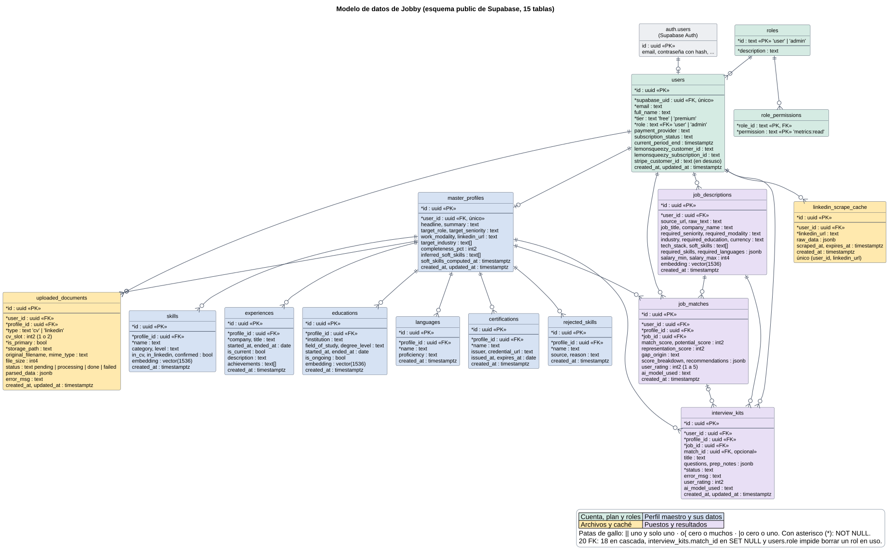

# Modelo de datos (DER)

Estado: Etapa 1. Verificado el 2026-09-21 contra las 22 migraciones de
`services/api/migrations` y contra los catálogos de la base real de Supabase (solo metadatos:
tablas, columnas, tipos, claves, índices y políticas; no se leyó ningún dato de personas). Las
columnas del diagrama se compararon una a una con `information_schema` y coinciden. Actualizado
el 2026-09-24 con las migraciones 023 a 027: dos funciones (una restaura la del CV principal y
otra verifica que la sesión de un token siga abierta), índices, el cierre de privilegios de la
clave pública y los roles con sus permisos (dos tablas nuevas y la columna `users.role`).

Fuente editable: `docs/diagramas/modelo-entidad-relacion.puml` (PlantUML). Para imprimir: lámina
A3 en [pdf/laminas/modelo-entidad-relacion.pdf](pdf/laminas/modelo-entidad-relacion.pdf).

## 1. Cómo leerlo

- Cada rectángulo es una tabla del esquema `public` con sus columnas y tipos de PostgreSQL.
  `auth.users` pertenece al servicio de identidad de Supabase y se dibuja solo como referencia.
- `<<PK>>` marca la clave primaria y `<<FK>>` la clave foránea; el asterisco (`*`), las
  columnas obligatorias (`NOT NULL`).
- Cardinalidad con patas de gallo: `||` uno y solo uno, `|o` cero o uno, `o{` cero o muchos.
- Colores: verde, cuenta, plan y roles; azul, perfil maestro y sus datos; amarillo, archivos y caché;
  violeta, puestos y resultados.

## 2. Tablas

| Tabla | Para qué sirve | ¿Datos de personas? |
|---|---|---|
| `users` | Cuenta, plan (`tier`: free o premium), rol (`role`: user o admin) y datos de la suscripción de LemonSqueezy. Rol y plan son ejes independientes. | Sí: correo y nombre |
| `roles` | Roles posibles: `user` y `admin` (migración 026). | No |
| `role_permissions` | Permisos de cada rol; hoy `admin` tiene `metrics:read`. Los endpoints exigen un permiso, nunca un nombre de rol. | No |
| `master_profiles` | Perfil profesional único de cada persona: titular, resumen, rol y seniority buscados, modalidad, industrias y porcentaje de perfil completo. | Sí |
| `uploaded_documents` | CV subidos: ruta en el almacén privado, estado del análisis y CV estructurado (`parsed_data`). | Sí: el contenido del CV |
| `skills` | Habilidades (confirmadas o no, si figuran en el CV o en LinkedIn) con su vector de 1536 números. | Sí |
| `experiences` | Experiencia laboral: empresa, cargo, fechas, descripción y logros. | Sí |
| `educations` | Estudios: institución, campo, nivel y fechas, con vector. | Sí |
| `languages` | Idiomas y nivel. | Sí |
| `certifications` | Certificaciones: emisor, fechas y enlace. | Sí |
| `rejected_skills` | Habilidades que la persona rechazó al revisar el resultado del CV. | Sí (bajo) |
| `job_descriptions` | Puestos analizados: texto original, datos estructurados y vector. | Texto pegado por la persona |
| `job_matches` | Resultado de comparar perfil y puesto: MatchScore, potencial, representación, origen de la brecha, desglose, recomendaciones y valoración de 1 a 5. | Derivado del perfil |
| `interview_kits` | Kits de entrevista del plan premium: preguntas, notas, estado y valoración. | Sí |
| `linkedin_scrape_cache` | Caché de siete días de las páginas de LinkedIn leídas para un kit. | Puede incluir datos de terceros |

## 3. Relaciones y cardinalidades

| Relación | Cardinalidad | Clave foránea | Al borrar el padre |
|---|---|---|---|
| `auth.users` – `users` | 1 a 0..1 | `users.supabase_uid` (única) | NO ACTION |
| `roles` – `users` | 1 a 0..N | `users.role` | NO ACTION: no se puede borrar un rol en uso |
| `roles` – `role_permissions` | 1 a 0..N | `role_permissions.role_id` | CASCADE |
| `users` – `master_profiles` | 1 a 0..1 | `master_profiles.user_id` (única) | CASCADE |
| `users` – `uploaded_documents` | 1 a 0..N | `uploaded_documents.user_id` | CASCADE |
| `master_profiles` – `uploaded_documents` | 1 a 0..N | `uploaded_documents.profile_id` | CASCADE |
| `master_profiles` – `skills`, `experiences`, `educations`, `languages`, `certifications`, `rejected_skills` | 1 a 0..N cada una | `profile_id` en cada tabla | CASCADE |
| `users` – `job_descriptions` | 1 a 0..N | `job_descriptions.user_id` | CASCADE |
| `users`, `master_profiles` y `job_descriptions` – `job_matches` | 1 a 0..N cada una | `user_id`, `profile_id` y `job_id` | CASCADE |
| `users`, `master_profiles` y `job_descriptions` – `interview_kits` | 1 a 0..N cada una | `user_id`, `profile_id` y `job_id` | CASCADE |
| `job_matches` – `interview_kits` | 0..1 a 0..N | `interview_kits.match_id` (opcional) | SET NULL |
| `users` – `linkedin_scrape_cache` | 1 a 0..N | `linkedin_scrape_cache.user_id` | CASCADE |

De las 20 claves foráneas entre tablas de la aplicación, 18 borran en cascada,
`interview_kits.match_id` queda vacía (el kit se conserva) y `users.role` impide borrar un rol
que alguien tiene asignado. La clave hacia `auth.users` no borra
en cascada: por eso el borrado de cuenta elimina primero la fila de `users` y después la identidad.

## 4. Reglas que impone la base

- **Unicidad:** `users.supabase_uid`, un perfil por persona, un solo CV principal por persona
  (índice parcial), una ranura por CV y una lectura de LinkedIn por persona y enlace.
- **Sin acceso con la clave pública:** desde la migración 025 (2026-09-23), los roles `anon` y
  `authenticated` no tienen ningún privilegio sobre las tablas, tampoco sobre las que se creen
  después: la web no las lee ni las escribe y todo pasa por la API. Antes, con su propio token,
  una persona podía cambiarse el plan a premium escribiendo su fila por la API REST de
  Supabase (se reprodujo en el proyecto de pruebas; `services/api/tests/sql/`).
- **Acceso por dueño (RLS):** las 15 tablas mantienen seguridad por fila como segunda barrera
  (`roles` y `role_permissions` sin políticas: solo las lee la API).
  La API usa la clave de servicio, que no pasa por RLS, así que en sus consultas el
  aislamiento entre personas depende de filtrar por el usuario que sale del token.
- **Vectores:** las columnas `embedding` usan pgvector (`vector(1536)`) con índices HNSW de
  coseno en `skills`, `educations` y `job_descriptions`.
- **Claves foráneas indexadas:** desde la migración 024 (2026-09-23) cada una tiene su índice.
  La API filtra por esas columnas en casi todas las consultas y los borrados en cascada las
  recorren; antes, 15 no tenían índice y cada una de esas operaciones leía la tabla entera.

El esquema no declara restricciones `CHECK`: los valores permitidos de `tier`, `status`, `type`,
`cv_slot`, `user_rating` y similares los valida la API con modelos Pydantic.

## 5. Diferencias entre las migraciones y la base real

- La función `set_primary_uploaded_document` de la migración 018 no había quedado aplicada en
  producción, aunque `PATCH /profiles/documents/{id}/set-primary` la invoca. Se restauró el
  2026-09-22 con la migración 023, probada antes en el proyecto de pruebas: las tres funciones
  del esquema son `SECURITY DEFINER` y solo las ejecuta la clave de servicio.
- Desde el 2026-09-22 hay un segundo proyecto de Supabase (plan gratuito) dedicado a las
  pruebas, con las mismas migraciones y sin datos de personas (Decisión 4).
- Hasta la 022, las migraciones se aplicaron desde el editor SQL y Supabase no las registró;
  de la 023 en adelante se aplicaron primero en el proyecto de pruebas y quedaron registradas.
- La base real corre PostgreSQL 17.6.
