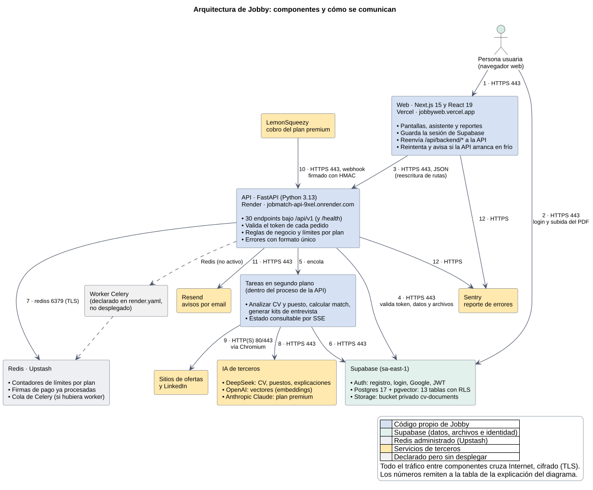
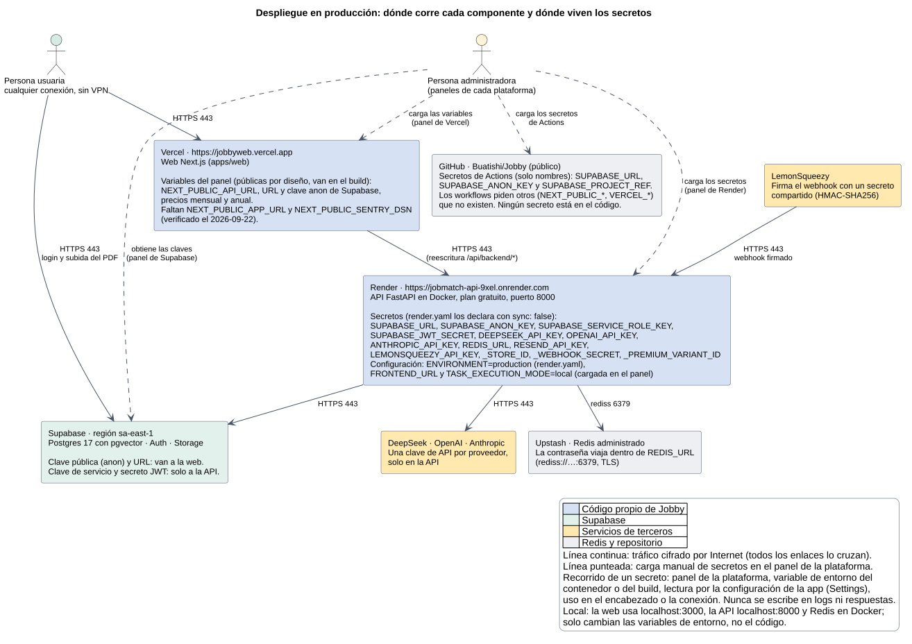
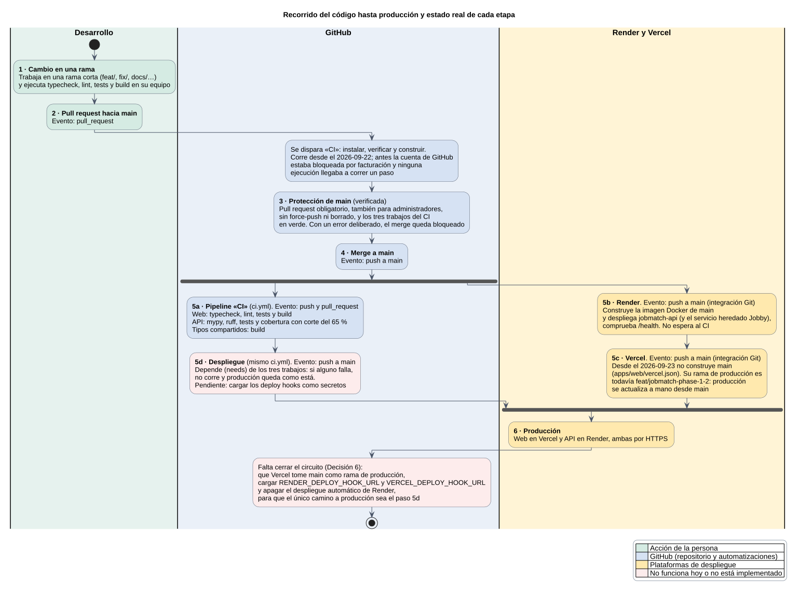

# Arquitectura y despliegue

Estado: Etapa 1. Verificado el 2026-09-21 y el 2026-09-22 contra `apps/web` (`next.config.ts`,
`lib/api/client.ts`, `lib/supabase`), `services/api` (`main.py`, `config.py`, `Dockerfile`),
`render.yaml`, `.github/workflows/`, `docker-compose.yml`, el README y comprobaciones de solo
lectura sobre producción. De los paneles de Vercel, Render y Supabase se documentan solo los
**nombres** de las variables, nunca sus valores.

## 1. Componentes y dónde corre cada uno

Para imprimir: láminas A3 en [pdf/laminas/](pdf/laminas/) (`arquitectura.pdf`,
`despliegue-y-secretos.pdf` y `recorrido-del-codigo.pdf`).

| Componente | Tecnología | Plataforma | URL productiva |
|---|---|---|---|
| Web (cliente) | Next.js 15, React 19, TypeScript | Vercel | <https://jobbyweb.vercel.app> |
| API | FastAPI, Python 3.13, imagen Docker | Render, plan gratuito, región Oregón | <https://jobmatch-api-9xel.onrender.com> |
| Tareas en segundo plano | Hilos dentro del proceso de la API (`TASK_EXECUTION_MODE=local`) | Render, el mismo servicio de la API | — |
| Base de datos, identidad y archivos | Supabase: PostgreSQL 17 con pgvector, Auth y Storage (bucket privado `cv-documents`) | Supabase, región sa-east-1 | La URL del proyecto se carga como variable |
| Redis | Redis administrado | Upstash | `rediss://…:6379` dentro de `REDIS_URL` |
| IA de terceros | DeepSeek (texto), OpenAI (vectores), Anthropic Claude (premium) | Servicios externos | `api.deepseek.com`, `api.openai.com`, `api.anthropic.com` |
| Cobros | LemonSqueezy | Servicio externo | Envía eventos a `POST /api/v1/webhooks/lemonsqueezy` |
| Emails y errores | Resend y Sentry | Servicios externos | — |

Además: `render.yaml` declara dos workers de Celery que nunca se crearon (Render no tiene plan
gratuito para ese tipo de servicio), y en Render existe un servicio heredado con el mismo código
(`jobby-fp0r.onrender.com`) que se reconstruye en cada push pero ya no usa nadie: desde el
2026-09-23 la web, si le faltan las variables, apunta a la API local de desarrollo y no a él.

## 2. Comunicaciones: protocolo, puerto y si cruzan Internet

Numeradas como en el diagrama.

| N.º | De → a | Protocolo y puerto | ¿Cruza Internet? | Qué viaja |
|---|---|---|---|---|
| 1 | Navegador → web | HTTPS 443 | Sí | Páginas y llamadas de la interfaz a `/api/backend/*` (mismo origen: sin CORS en el navegador). |
| 2 | Navegador → Supabase | HTTPS 443 | Sí | Registro, login, Google, renovación del token y subida del PDF con la sesión de la persona. |
| 3 | Web (Vercel) → API | HTTPS 443 | Sí | JSON con el token `Bearer`; Vercel reescribe `/api/backend/*` a `/api/v1/*`. |
| — | Balanceador de Render → contenedor | HTTP 8000 | No, red interna de Render | Render termina el TLS y reenvía al puerto 8000 del contenedor. |
| 4 | API → Supabase | HTTPS 443 | Sí | Consultas por PostgREST con la clave de servicio, claves públicas para validar el token y archivos. |
| 5 | API → tareas | Llamada dentro del mismo proceso | No | La orden de procesar un CV, un puesto o un match. |
| 6 | Tareas → Supabase | HTTPS 443 | Sí | Estado, resultados, vectores y descarga del PDF. |
| 7 | API → Redis | `rediss` (TLS) 6379 | Sí | Contadores de límites por plan y claves de idempotencia del webhook. |
| 8 | Tareas → IA | HTTPS 443 | Sí | Texto del CV o del puesto y pedidos de vectores; tiempo límite de 60 s con reintentos. |
| 9 | Tareas → sitios de ofertas y LinkedIn | HTTP o HTTPS 80/443 | Sí | Lectura de páginas con un navegador sin interfaz, con guarda anti-SSRF. |
| 10 | LemonSqueezy → API | HTTPS 443 | Sí | Eventos de suscripción firmados con HMAC-SHA256. |
| 11 | API → Resend | HTTPS 443 | Sí | Avisos por email. |
| 12 | API y web → Sentry | HTTPS 443 | Sí | Eventos de error (solo si hay DSN configurado). |

No hay red privada, VPN ni túneles entre componentes: todo lo que cruza Internet va cifrado con
TLS y se protege con tokens de sesión y con secretos guardados en cada plataforma.

## 3. Secretos: dónde viven y cómo llegan a cada componente

| Dónde se cargan | Variables (solo nombres) | Quién las usa |
|---|---|---|
| Panel de Vercel | `NEXT_PUBLIC_API_URL`, URL y clave anon de Supabase, precios mensual y anual | La web. Las `NEXT_PUBLIC_*` se incrustan en el JavaScript del navegador: son públicas por diseño. La clave anon no es secreta; la protegen las políticas RLS. `NEXT_PUBLIC_SENTRY_DSN` no está cargada: Sentry queda sin activar en la web. |
| Panel de Render (declaradas en `render.yaml` con `sync: false`, sin valor) | `SUPABASE_URL`, `SUPABASE_ANON_KEY`, `SUPABASE_SERVICE_ROLE_KEY`, `SUPABASE_JWT_SECRET`, `DEEPSEEK_API_KEY`, `OPENAI_API_KEY`, `ANTHROPIC_API_KEY`, `REDIS_URL`, `RESEND_API_KEY`, `LEMONSQUEEZY_API_KEY`, `LEMONSQUEEZY_STORE_ID`, `LEMONSQUEEZY_WEBHOOK_SECRET`, `LEMONSQUEEZY_PREMIUM_VARIANT_ID` | Solo la API. La clave de servicio de Supabase no pasa por RLS: es la más sensible y nunca llega al navegador. |
| Panel de Render (configuración no secreta) | `ENVIRONMENT=production`, `PORT`, `FRONTEND_URL`, `TASK_EXECUTION_MODE=local` | `ENVIRONMENT=production` cierra `/docs` y agrega HSTS y CSP; `FRONTEND_URL` alimenta CORS. |
| Secretos de GitHub Actions | `SUPABASE_URL`, `SUPABASE_ANON_KEY`, `SUPABASE_PROJECT_REF` | Ningún workflow los usa hoy. |
| Equipo local | `.env` y `.env.local` a partir de `.env.example` | Ignorados por Git: el repositorio solo versiona `.env.example`, sin valores. |

**Recorrido de un secreto** (ejemplo: la clave de servicio de Supabase):

1. Se genera en el panel de Supabase.
2. Una persona administradora la copia al panel de Render; `render.yaml` solo declara el nombre,
   así que el valor nunca pasa por Git.
3. Render la inyecta como variable de entorno del contenedor al arrancar.
4. `app/config.py` (pydantic-settings) la lee como `supabase_service_role_key`.
5. `app/database.py` crea con ella el cliente de Supabase, que la envía por HTTPS en un
   encabezado de cada consulta.
6. No se escribe en logs ni en respuestas: el registro de accesos guarda solo método, ruta,
   estado y duración, y los errores públicos se devuelven sin detalle interno.

Las variables `NEXT_PUBLIC_*` siguen otro camino: se cargan en Vercel, se incrustan en el build
y llegan al navegador; por eso nunca contienen secretos.

## 4. Recorrido del código hasta producción

| Etapa | Evento que la dispara | Qué hace | Estado verificado |
|---|---|---|---|
| 1. Cambio en una rama | Trabajo local | Typecheck, lint, tests y build en el equipo. | Funciona |
| 2. Pull request hacia `main` | `pull_request` | Dispara el workflow «CI». | Funciona desde el 2026-09-22: hasta ese día la cuenta de GitHub estaba bloqueada por facturación y ninguna ejecución llegaba a correr un paso |
| 3. Protección de `main` | — | Pull request obligatorio también para administradores, sin force-push ni borrado, y los tres trabajos del CI en verde. | Funciona. Comprobado con un error deliberado: el CI quedó en rojo y GitHub bloqueó el merge |
| 4. Merge a `main` | `push` a `main` | Dispara el CI y los despliegues. | Funciona |
| 5a. CI (`ci.yml`) | `push` y `pull_request` | Web: typecheck, lint, tests y build. API: mypy, ruff, tests y cobertura con corte del 65 %. Tipos compartidos: build. | Funciona; cobertura medida: 80,23 % |
| 5b. Render | `push` a `main` (integración con Git) | Construye la imagen y despliega `jobmatch-api` (y el servicio heredado). | Funciona, pero todavía no espera al CI: se apaga cuando se cargue el deploy hook |
| 5c. Vercel | `push` a `main` (integración con Git) | Hasta el 2026-09-23 construía `main` solo como vista previa; desde entonces `apps/web/vercel.json` lo desactiva. La rama de producción configurada es todavía `feat/jobmatch-phase-1-2`. | Producción se actualiza a mano: el último despliegue productivo se creó desde `main` el 2026-09-23 |
| 5d. Despliegue (`ci.yml`) | `push` a `main`, con `needs` sobre los tres trabajos | Llama a los deploy hooks de Render y Vercel. | Pendiente de los secretos `RENDER_DEPLOY_HOOK_URL` y `VERCEL_DEPLOY_HOOK_URL`: mientras faltan, el trabajo lo avisa |
| 6. Producción | — | Web y API por HTTPS. | Funciona |

Lo que falta para cerrar el circuito (Decisión 6): en Vercel, tomar `main` como rama de
producción y crear su deploy hook; en Render, copiar el deploy hook y apagar el despliegue
automático; y cargar los dos como secretos del repositorio. Así el único camino a producción
es el trabajo que depende del CI.

La evidencia de una ejecución fallida con su corrección ya está en el historial del pipeline
(rama `ci/verificacion-del-corte`, 2026-09-22): se bajó a propósito el mínimo de perfil de
60 % a 50 %, un test lo detectó, el despliegue no corrió y el commit siguiente lo revirtió.

## 5. Ambiente local frente a producción

| Elemento | Local | Producción |
|---|---|---|
| Web | `pnpm dev` en `http://localhost:3000` | Vercel, `https://jobbyweb.vercel.app` |
| API | `uvicorn` en `http://localhost:8000` (con `/docs` abierto) | Render, Docker, puerto 8000 detrás de HTTPS; `/docs` cerrado |
| Dirección de la API que usa la web | `NEXT_PUBLIC_API_URL=http://localhost:8000` (valor de `.env.example`) | `NEXT_PUBLIC_API_URL` apunta a la API de Render |
| Redis | `docker compose up -d` (puerto 6379, sin TLS) | Upstash con TLS (`rediss`) |
| Tareas | Modo local o Celery, según `TASK_EXECUTION_MODE` | Modo local |
| Supabase | Un proyecto remoto, el que indique `.env`; no hay instancia local | Proyecto de producción en sa-east-1 |
| Secretos | Archivos `.env` y `.env.local`, fuera de Git | Paneles de Vercel y Render |

La diferencia entre ambientes se resuelve solo con variables de entorno: el mismo código apunta a
la API local o a la productiva según `NEXT_PUBLIC_API_URL`. El `docker-compose.yml` levanta solo
Redis: la base de datos es Supabase también en desarrollo.
