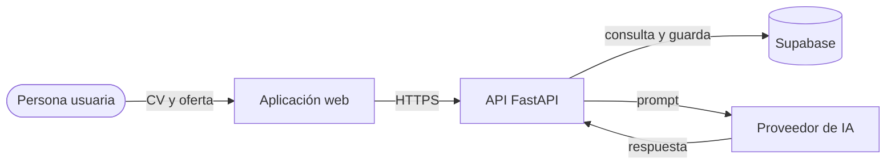
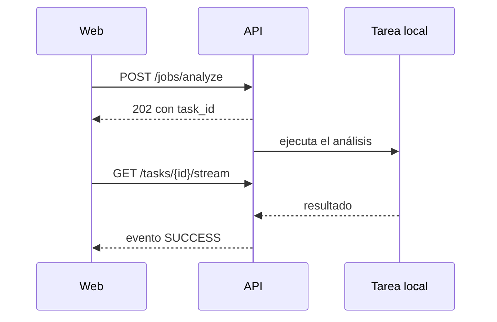
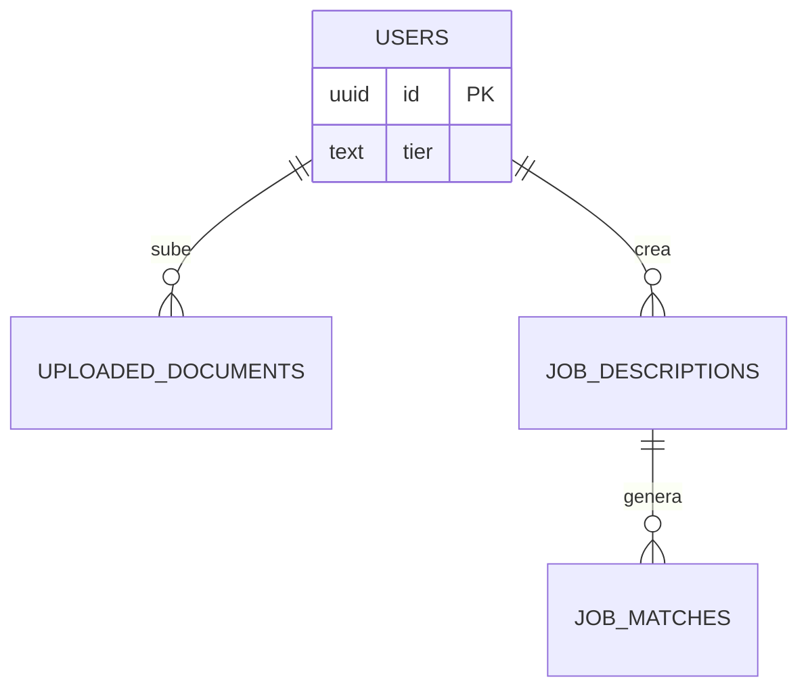
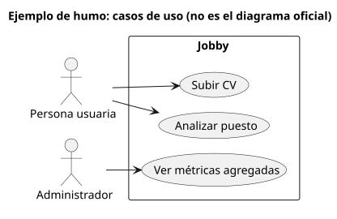

# Ejemplo de humo de las herramientas de documentación

Este documento comprueba que Markdown, Mermaid y PlantUML llegan al PDF. **No es** la
documentación oficial del proyecto: sirve de plantilla para los diagramas de la Etapa 1.

## 1. Flujo de datos (Mermaid, flowchart)

## 2. Secuencia (Mermaid, sequenceDiagram)

## 3. Modelo de datos (Mermaid, erDiagram)

## 4. Casos de uso UML (PlantUML, SVG generado)

| Herramienta | Uso recomendado |
|---|---|
| Mermaid | DFD, secuencia, ER y flujos dentro de los `.md` |
| PlantUML | UML formal: casos de uso y despliegue |
